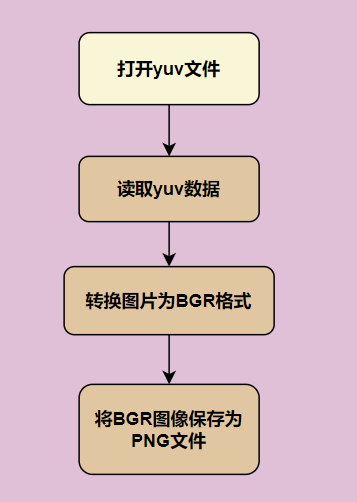

# <center> HiBao Pro:您的全场景智能助手

> 嵌入式芯片和系统设计竞赛 海思赛道
>
> 队伍名：Can Can Need	队伍编号：13458
> 
> 队员: 彭冠旗, 郭一凡, 侯文星
>
> 指导老师: 余浩

## 摘要 
&emsp;&emsp;当今AI大模型快速发展，在对话、识别等方面均有应用。但据观察，大模型还没有良好融入日常工作生活场景。为此，我们开发了一款基于Hi3516DV300和云端多模态大模型，可用于生活、学习、工作、助残等多种实用环境的全场景智能助手。

​	本作品在Taurus模组端进行手势检测和图片抓拍，实现了手部检测、手势识别、图像拍摄与录音、图片与音频发送等功能，支持板间无线互联，并可向用户提供系统状态提示音反馈。在Pegasus端实现了文本转语音和信号转发。在上位机端实现了语音转文本能力，并调用“零一万物"云端多模态大模型实现了语义和图像理解。用户可通过手势或按键实时控制系统，并通过语音描述大模型任务目标。系统收到控制信号后将图像和语音描述上传至云端大模型处理，提供建议并返回Pegasus端进行语音播报。

&emsp;&emsp;本系统设计简洁，功能强大，便于用户随身携带和使用，适用于多种场景，可极大的提升用户便利性和幸福感。未来可以优化手势检测网络，添加手部关节点识别等功能使系统更完善，从而进一步拓展与大模型的交互能力和物联网控制能力。还计划开发微信小程序实现个性化功能定制，使用户获得更强大的操作能力，实现更广泛的应用场景。

## 作品概述

### 1.1	功能特性

&emsp;&emsp;该系统在Hi3516DV300上实现了手部检测、手势识别、图像、视频录制、录音、图片与音频发送等功能。用户可以通过手势或按键与系统进行实时交互，控制Taurus模组进行拍照。随后语音描述需针对图片实现的任务目标如咨询、识别等。系统会将包含场景图像和语音描述的任务传至云大模型进行处理，根据结果给出相关建议并用语音播报。

&emsp;&emsp;该作品小巧简洁，可使用电源或充电宝供电，方便随身携带。支持使用非接触手势和接触式按键两种方式控制，使用场景多样。可以在多种生活、工作、场景中发挥作用。提升人们工作生活中的方便性，增强幸福感。

### 1.2	应用领域

&emsp;&emsp;本作品预计可用于生活服务、办公作业、残疾人辅助等多种场景，适用性广泛，市场前景良好。具体如下：

* **生活服务场景**
  
  本作品可以极大提升用户的便利性。例如用户只需拿起Taurus模组拍摄冰箱内的食材，AI大模型即可实时分析并提供多种菜谱建议。通过语音控制，还可以了解食材的保质期、获取购物清单推荐等，全面优化家庭饮食管理。

* **少儿学习场景**
  
  本作品可以辅助孩子进行互动学习。如孩子拍摄学习材料后，AI大模型可实时分析并提供相关的学习建议和解答。通过语音控制，孩子还可以获得知识拓展、检查作业正误等，提升学习效率和兴趣。

* **工作学习场景**
  
  本作品能够帮助用户提高效率。如拍摄文件或白板内容后，AI大模型可以实时处理并生成文字记录或摘要。通过语音指令，用户可以管理日程、搜索资料，进行远程会议的记录和分析等，简化工作流程。

* **助残场景** 
  
  本作品可助力提升残障人士生活质量。充分利用了多模态大模型的场景描述能力和任务规划能力，为残障人士提供更便捷、高效、安全的生活服务。如对于视障人士，本产品可以提供详细的场景描述和文本阅读等功能，帮助其更快适应陌生的环境或找寻物品。

### 1.3	主要技术特点

1. 手势检测和识别。本作品利用Hi3516DV300芯片的图像分析模块，实现了基于Yolov2模型的实时手势检测和识别，并可以通过识别结果对整套系统进行控制。
2. 多模态大模型处理。通过api调用“零一万物"云端多模态大模型，使该系统拥有强大的语义和图像理解能力，能够根据场景描述和任务规划，高效地完成各种任务，如总结图片内容、发送邮件等。
3. 无线互联。该作品的三个组成部分（Taurus端、Pegasus端、PC/Server端）均使用无线方式（TCP，Histreaming, NFS）进行互联。可远程无接触操作。
4. 高效的文本转语音。在Pegasus端实现了针对亚博智能的智能语音播报模块（内置XFS5152CE芯片）的I2C驱动基本代码移植，可以实现量大、准确和流畅的中文语音转换。
5. 高准确率的语音转文本。通过调用科大讯飞语音文字转换api，实现了高准确率的语音到文本转换。
6. 按键控制。在支持手势控制同时，也支持了使用Taurus端的两个按键对整套系统进行控制。适用场景广泛。
7. 系统状态提示音。Taurus端实现在功能实现的的过程中对系统的当前状态进行语音播报。给出了实时操作反馈，方便操作。

### 1.4	主要性能指标

本系统功能经过测试，结果如下：

1. 手势检测和识别。在测试过程中，该系统能够准确识别手势，并在约1m距离内准确识别手势。
2. 通过调用“零一万物”API实现了多模态大模型处理能力。在测试过程中，该系统能够处理多种场景描述和任务规划，并给出合理的建议。处理图片和用户需求反应时间在10s左右。
3. 文本转语音模块使用XFS5152芯片合成了语音。流畅自然，无明显卡顿。
4. 语音转文本模块使用科大讯飞语音API能够处理较长的普通话文本。正确率高，无错听误听情况。
5. 按键控制。在测试过程中，能够通过按键控制整套系统。
6. 系统功能全面，为用户提供了高效的智能控制体验。

### 1.5	主要创新点

1. 调用“零一万物"云端多模态大模型，使该系统拥有强大的语义和图像理解能力，能够根据场景描述和任务规划，高效地完成各种任务。
2. 可以同时使用手势和按键对系统进行控制，操作简单便捷。实现了敏捷的手势识别，方便用户远程无接触操作，有利于拓展该作品的使用场景。同时也支持按键操作。
3. 该作品的三个组成部分（Taurus端、Pegasus端、PC/Server端）均使用无线方式（TCP，Histreaming, NFS）进行互联。无需硬件连接。大大减少了使用场景限制，有利于用户随身携带和布置使用。同时也有利于分模块进行调试和系统模块升级更换。
4.  拓展了大模型功能，为大模型增加了邮件发送能力，使用户可以便捷地通过语音交互将与HiBao交流中的关键信息和图片保存至邮箱。如要求HiBao对当前场景进行总结并将总结信息发送到用户邮箱等。
5. 在Pegasus端使用亚博智能智能语音播报模块并在Pegasus端完成了该模块基本操作代码移植，实现了高效的本地文字转语音能力。
6. 成功集成了科大讯飞云端语音转文字能力，低延迟/高准确率的实现了语音文字转换。

## 系统组成及功能说明

### 2.1	整体介绍

#### 系统整体框图：


#### 整体介绍与联系

* **Taurus端**负责手势检测和识别系统控制、按键系统控制、图像抓拍、语音录制、系统状态语音播报、实时图像显示和手势识别的实时反馈。通过与**PC/Server端**的**NFS共享文件夹**，将捕获的图像和录制的音频保存到**NFS共享文件夹**中，使**PC/Server端**能够获取；通过**Histreaming**与**Pegasus端**进行通信，控制系统状态。
* **Pegasus端**负责文字转语音模块的驱动和系统控制信号的中转。通过**TCP**与**PC/Server**进行通信，获取大模型的返回结果并进行语音播报；通过**Histreaming**与**Taurus端**进行通信，将来自于Taurus的系统控制信号转发给PC/Server端。
* **PC/Server端**负责图片和语音处理、多模态大模型的能力调用、对话过程的整理和大模型附加功能（邮件发送）的实现，通过**NFS附加文件夹**获取来自于**Taurus端**的图片和语音，通过**TCP**与**Pegasus端**进行通信，获取系统控制信号，对后台数据进行处理；将大模型的返回信息发送给**Pegasus端**。

### 2.2 Taurus 端介绍

#### 2.2.1 Taurus 端整体介绍

&emsp;&emsp;Taurus 端实现了**手势检测和识别控制**、**按键控制**、**图像抓拍**、**语音录制**、**系统状态语音播报**、**实时图像显示**和**手势识别的实时反馈**功能。在Taurus端，可以同时使用手势和按键对整体系统进行控制。

&emsp;&emsp;在Taurus完全启动后，程序分三个线程进行运行，分别是语音处理线程、图像处理线程和结束信号检测线程。其中，语音处理线程包括语音录制和系统状态语音播报功能，图像处理线程包括手势检测和识别、图像抓拍和手势识别的实时反馈，结束信号检测线程用于监听来自键盘的退出信号。其余功能，如按键和通信功能同时在不同的线程中运行。图像处理线程和语音处理线程之间的交流如下图所示，其中若某个模块没有被箭头指向，则证明其在每一次循环中都会运行，否则需要箭头来源的信号来使能该模块运行。


#### 2.2.2 Taurus 端各模块介绍

##### 系统的主要功能模块包括:

1. **手势检测和识别模块**：通过调用Hi3516DV300芯片的图像分析模块，实现了基于Yolov2模型的实时手势检测和识别，并基于识别结果对整套系统进行控制。当手势为YES时，系统会控制Taurus进行抓拍；当手势为手掌时，系统会控制Taurus进行录音。
2. **按键控制模块**：通过调用Taurus的两个按键，实现了对整套系统进行控制。
3. **图像抓拍模块**：从VPSS获取图像帧，在经过图像resize和图像色彩格式转换后，将图像文件以yuv的格式保存到NFS共享文件夹中。
4. **语音录制模块**：调用Hi3516DV300芯片的音频模块vi和venc，实现了可以控制录制时长的录音功能，将录制的音频文件以aac格式保存到NFS共享文件夹中。
5. **系统状态语音播报模块**：通过调用Hi3516DV300芯片的音频模块vdec和vo，实现了通过读取本地aac音频文件来进行特点语音播报的功能。

##### 手势检测和识别模块

&emsp;&emsp;手势检测和识别模块基于ai sample进行开发，基于Yolov2模型实现了实时手势检测和识别。以下为该模块的调用过程：

```c
ret = HI_MPI_VPSS_GetChnFrame(g_aicMediaInfo.vpssGrp, g_aicMediaInfo.vpssChn0, &frm, s32MilliSec); // 获取图像帧
if (ret != 0) {
    SAMPLE_PRT("HI_MPI_VPSS_GetChnFrame FAIL, err=%#x, grp=%d, chn=%d\n",
        ret, g_aicMediaInfo.vpssGrp, g_aicMediaInfo.vpssChn0);
    ret = HI_MPI_VPSS_ReleaseChnFrame(g_aicMediaInfo.vpssGrp, g_aicMediaInfo.vpssChn0, &frm);
    if (ret != HI_SUCCESS) {
        SAMPLE_PRT("Error(%#x),HI_MPI_VPSS_ReleaseChnFrame failed,Grp(%d) chn(%d)!\n",
            ret, g_aicMediaInfo.vpssGrp, g_aicMediaInfo.vpssChn0);
    }
    continue;
}
SAMPLE_PRT("get vpss frame success, weight:%d,height:%d\n", frm.stVFrame.u32Width, frm.stVFrameu32Height);
if (g_num == 0) {
    ConfBaseInit(AI_SAMPLE_CFG_FILE);
    g_num++;
}
HandClassifyAiProcess(frm, voLayer, voChn); // 将图像帧投入yolov2模型进行检测和识别
gestureNameNow = returnGestureName();
printf("%d",gestureNameNow);
```

我们重新定义了一个set函数和get函数，用于跨文件访问模型推理的结果：

```c
void setGestureName(int name) { //设置本轮推理结果
    gestureName2 = name;
}

int returnGestureName() { //获取本轮推理结果
    return gestureName2;
}
static void HandDetectFlag(const RecogNumInfo resBuf)
{
    HI_CHAR *gestureName = NULL;
    switch (resBuf.num) {
        case 0u:
            gestureName = "gesture fist"; // 拳头手势
            setGestureName(0);
            SAMPLE_PRT("----gesture name----:%s\n", gestureName);
            break;
        case 1u:
            gestureName = "gesture indexUp"; // 食指手势
            setGestureName(1);
            SAMPLE_PRT("----gesture name----:%s\n", gestureName);
            break;
        case 2u:
            gestureName = "gesture OK"; // OK手势
            setGestureName(2);
            SAMPLE_PRT("----gesture name----:%s\n", gestureName);
            break;
        case 3u:
            gestureName = "gesture palm"; // 手掌手势
            setGestureName(3);
            SAMPLE_PRT("----gesture name----:%s\n", gestureName);
            break;
        case 4u:
            gestureName = "gesture yes"; // yes手势
            setGestureName(4);
            SAMPLE_PRT("----gesture name----:%s\n", gestureName);
            break;
        case 5u:
            gestureName = "gesture pinchOpen"; // 食指 + 大拇指
            setGestureName(5);
            SAMPLE_PRT("----gesture name----:%s\n", gestureName);
            break;
        case 6u:
            gestureName = "gesture phoneCall"; // 大拇指 + 小拇指
            setGestureName(6);
            SAMPLE_PRT("----gesture name----:%s\n", gestureName);
            break;
        default:
            gestureName = "gesture others"; // 无效值
            setGestureName(7);
            SAMPLE_PRT("----gesture name----:%s\n", gestureName);
            break;
    }
    SAMPLE_PRT("hand gesture success\n");
}
```

##### 按键控制模块

&emsp;&emsp;按键控制模块包括按键初始化和按键值检测.当按键被按下时，检测方法返回1，否则返回0。由于每次按下，在不加延时的情况下，都会返回多个值，因此需要加延时，防止由于输出过多导致系统操作错误。

```c
int gpio1_fd = -1;
int gpio2_fd = -1;
int ret1     = -1;
int ret2     = -1;
char key1_value[10];
char key2_value[10];

int SWITCH_INIT(void)
{
    /*
     * 按键初始化定义
     * Key initialization definition
     */

    InitGpio1();
    InitGpio2();

    gpio1_fd = open("/sys/class/gpio/gpio1/value", O_RDONLY);
    if (gpio1_fd < 0)
    {
        MSG("Failed to open gpio1 !\n");
    }

    gpio2_fd = open("/sys/class/gpio/gpio2/value", O_RDONLY);
    if (gpio2_fd < 0)
    {
        MSG("Failed to open gpio1 !\n");
    }
}

int CHECK_SWITCH_F1(void) {
    /*
     * 检测按键F1
     */
    memset(key2_value, 0, sizeof(key2_value));
    lseek(gpio2_fd, 0, SEEK_SET);
    ret2 = read(gpio2_fd, key2_value, sizeof(key2_value));
    if ((key2_value[0] - '0') == 0) {
        MSG("F1 is pressed\n");
        usleep(1*1000000);
        return 1;
    }
    else {
        return 0;
    }
}

int CHECK_SWITCH_F2(void) {
    /*
     * 检测按键F2
     */
    memset(key1_value, 0, sizeof(key1_value));
    lseek(gpio1_fd, 0, SEEK_SET);
    ret1 = read(gpio1_fd, key1_value, sizeof(key1_value));
    if ((key1_value[0] - '0') == 0) {
        MSG("F2 is pressed\n");
        usleep(1*1000000);
        return 1;
    }
    else {
        return 0;
    }
}
```

##### 图像抓拍模块

&emsp;&emsp;以下代码描述了图像抓拍模块的调用过程。在检测到yes手势或者F1按键按下3秒后，调用图像抓拍模块，这个延时的目的是避免用户在通过手势控制抓拍后把手势留在画面中。此后，该模块经过了以下几个流程：

1. 设置状态同步信号，同步图像处理线程和音频处理线程，以此进行系统状态语音播报；
2. 修改保存图像名，让每次保存的图像文件不会互相覆盖，避免了可能的文件保存问题；
3. 从VPSS获取图像帧；
4. 对获取到的图像帧进行resize，避免保存的图像过大，导致同步时间过长，保存图像的大小为640*480；
5. 图像色彩转换，从VIDEO_FRAME转换为IVE_IMAGE；
6. 将图像帧保存到本地；
7. 对内存进行回收和置零。

```c
if (gestureNameNow == 4 || CHECK_SWITCH_F1()) { // yes

    capture_signal = 1;
    usleep(3 * 1000000);
    setGestureName(-1);
    printf("-=-=-=-=-=-=-=-=-=-=-=-=-=-=-=-=-=-=- get44444444444444 : image save -=-=-=-=-=-=-=-=-=-=-=-=-=-=-=-=-=-=-\n");
    if (snprintf_s(achDstFileName, sizeof(achDstFileName), sizeof(achDstFileName) - 1,
        "/mnt/image/%d.yuv", cnt) < 0) { // 修改保存图像名
        HI_ASSERT(0);
    }
    cnt += 1;
    g_stColorSpaceInfo.pFpDst = fopen(achDstFileName, "wb");
    ret = HI_MPI_VPSS_GetChnFrame(g_aicMediaInfo.vpssGrp, g_aicMediaInfo.vpssChn0, &frm, s32MilliSec); //从VPSS获取图像帧；
    if (ret != 0) {
        SAMPLE_PRT("HI_MPI_VPSS_GetChnFrame FAIL, err=%#x, grp=%d, chn=%d\n",
            ret, g_aicMediaInfo.vpssGrp, g_aicMediaInfo.vpssChn0);
        ret = HI_MPI_VPSS_ReleaseChnFrame(g_aicMediaInfo.vpssGrp, g_aicMediaInfo.vpssChn0, &frm);
        if (ret != HI_SUCCESS) {
            SAMPLE_PRT("Error(%#x),HI_MPI_VPSS_ReleaseChnFrame failed,Grp(%d) chn(%d)!\n",
                ret, g_aicMediaInfo.vpssGrp, g_aicMediaInfo.vpssChn0);
        }
        continue;
    }
    SAMPLE_PRT("get vpss frame success, weight:%d, height:%d\n", frm.stVFrame.u32Width, frm.stVFrame.u32Height);
    VIDEO_FRAME_INFO_S resizeFrm;
    ret = MppFrmResize(&frm, &resizeFrm, HAND_FRM_WIDTH, HAND_FRM_HEIGHT); // 对获取到的图像帧进行resize
    
    s32Ret = FrmToOrigImg(&resizeFrm, &img); // 图像色彩转换
    LOGI("IVE_IMAGE_S====width:%d, height:%d, entype:%d\n", img.u32Width, img.u32Height, img.enType);
    LOGI("VIDEO_FRAME_INFO_S====width:%d, height:%d, entype:%d\n",
        frm.stVFrame.u32Width, frm.stVFrame.u32Height, frm.stVFrame.enPixelFormat);
    LOGI("congratulate FrmToOrigImg success\n");
    SAMPLE_CHECK_EXPR_GOTO(HI_SUCCESS != s32Ret, CONVERT_FAIL, "Error(%#x), FrmToOrigImg failed!\n", s32Ret);
    
    printf("\n-------------------------------------------------------------------------------------\n");
    s32Ret = SAMPLE_COMM_IVE_WriteFile(&img, g_stColorSpaceInfo.pFpDst); // 将图像帧保存到本地
    SAMPLE_CHECK_EXPR_GOTO(HI_SUCCESS != s32Ret, CONVERT_FAIL,
        "Error(%#x), SAMPLE_COMM_IVE_WriteFile failed!\n", s32Ret);
    // 对内存进行回收和置零
    MppFrmDestroy(&resizeFrm);
    memset_s(&frm, sizeof(VIDEO_FRAME_INFO_S), 0, sizeof(VIDEO_FRAME_INFO_S));
    memset_s(&img, sizeof(IVE_IMAGE_S), 0, sizeof(IVE_IMAGE_S));
    t = 1;
    capture_end_signal = 1;
}
```

##### 语音录制模块

&emsp;&emsp;以下代码为语音录制模块的调用过程。在检测到手掌手势或者F2按键按下后，调用语音录制模块。随后首先打开保存音频的文件，建立aenc和vi通道进行录制；当再次检测到手掌手势或者F2按键按下后，退出录制，并且通过Histreaming向Pegasus和PC/Server发送录制完成信号。

```c
static HI_VOID SAMPLE_AUDIO_StartAdecAo(HI_BOOL bSendAdec, AUDIO_DEV AoDev, AENC_CHN AeChn, AIO_ATTR_S *pstAioAttr)
{
    HI_S32 s32Ret, s32AoChnCnt;
    const AO_CHN AoChn = 0;
    const ADEC_CHN AdChn = 0;
    FILE *pfd = NULL;
    if (bSendAdec == HI_TRUE) {
        s32AoChnCnt = pstAioAttr->u32ChnCnt;
        pfd = SAMPLE_AUDIO_OpenAencFile(AdChn, gs_enPayloadType);
        if (pfd == NULL) {
            SAMPLE_DBG(HI_FAILURE);
            goto STOP_AO;
        }
        s32Ret = SAMPLE_COMM_AUDIO_CreateTrdAencAdec(AeChn, AdChn, pfd);
        if (s32Ret != HI_SUCCESS) {
            (HI_VOID)fclose(pfd);
            pfd = HI_NULL;
            SAMPLE_DBG(s32Ret);
            goto STOP_AO;
        }
    }
    printf("\n======================== please press F2 to exit audio recording ========================\n");
    while(1) {
        if (getState() == 0) {
            break;
        }
    }
    if (bSendAdec == HI_TRUE) {
    DESTORY_AENC_THREAD:
        (HI_VOID)SAMPLE_COMM_AUDIO_DestroyTrdAencAdec(AdChn);
    STOP_AO:
    STOP_ADEC:
        printf("-=-=-=-=-=-=-=-=-=-=-=-=-=-=-=-=-=-=-=-=-=-=-=-=-=--=\n");
        HISTREAMING_SEND();
    }
}

HI_S32 AUDIO_START(HI_VOID)
{
    HI_BOOL bSendAdec = HI_TRUE;
    AUDIO_DEV AiDev = SAMPLE_AUDIO_INNER_AI_DEV;
    AUDIO_DEV AoDev = SAMPLE_AUDIO_INNER_AO_DEV;

    SAMPLE_AUDIO_StartAdecAo(bSendAdec, AoDev, AeChn_, stAioAttr_);
}
```

##### 系统状态语音播报模块

&emsp;&emsp;系统状态语音播报模块通过读取并播放本地保存的音频文件来指示当前的系统状态。以下代码以播报“好的，结束录音”为例。该流程中建立了aenc到ao的通道，将音频aac文件经过解码后播放。每次播放都会停止对现有ao和aenc的绑定，避免出现通道占用。

```c
HI_S32 AUDIO_READ_START_END_RECORD(HI_VOID)
{
    HI_S32 s32Ret, s32AoChnCnt;
    const AO_CHN AoChn = 0;
    AIO_ATTR_S stAioAttr;
    AUDIO_DEV AoDev = SAMPLE_AUDIO_INNER_AO_DEV;

    FILE *pfd = NULL;

    sample_audio_adec_ao_init_param(&stAioAttr_);

    s32Ret = SAMPLE_COMM_AUDIO_StartAdec(AdChn_, gs_enPayloadType);
    if (s32Ret != HI_SUCCESS) {
        SAMPLE_DBG(s32Ret);
        return s32Ret;
    }

    s32AoChnCnt_ = stAioAttr_.u32ChnCnt;
    s32Ret = SAMPLE_COMM_AUDIO_StartAo(AoDev, s32AoChnCnt_, &stAioAttr_, g_in_sample_rate, gs_bAioReSample);
    if (s32Ret != HI_SUCCESS) {
        SAMPLE_DBG(s32Ret);
        s32Ret = SAMPLE_COMM_AUDIO_StopAdec(AdChn_);
        if (s32Ret != HI_SUCCESS) {
            SAMPLE_DBG(s32Ret);
        }
        return s32Ret;
    }

    s32Ret = SAMPLE_COMM_AUDIO_CfgAcodec(&stAioAttr_);
    if (s32Ret != HI_SUCCESS) {
        SAMPLE_DBG(s32Ret);
        s32Ret = SAMPLE_COMM_AUDIO_StopAo(AoDev, s32AoChnCnt_, gs_bAioReSample);
        if (s32Ret != HI_SUCCESS) {
            SAMPLE_DBG(s32Ret);
        }
        s32Ret = SAMPLE_COMM_AUDIO_StopAdec(AdChn_);
        if (s32Ret != HI_SUCCESS) {
            SAMPLE_DBG(s32Ret);
        }
        return s32Ret;
    }

    s32Ret = SAMPLE_COMM_AUDIO_AoBindAdec(AoDev, AoChn, AdChn_);
    if (s32Ret != HI_SUCCESS) {
        SAMPLE_DBG(s32Ret);
        return s32Ret;
    }

    pfd = SAMPLE_AUDIO_OpenAdecFile(AdChn_, gs_enPayloadType, 1);
    if (pfd == NULL) {
        SAMPLE_DBG(HI_FAILURE);
        s32Ret = SAMPLE_COMM_AUDIO_AoUnbindAdec(AoDev, AoChn, AdChn_);
        if (s32Ret != HI_SUCCESS) {
            SAMPLE_DBG(s32Ret);
        }
        return s32Ret;
    }

    s32Ret = SAMPLE_COMM_AUDIO_CreateTrdFileAdec(AdChn_, pfd);
    if (s32Ret != HI_SUCCESS) {
        (HI_VOID)fclose(pfd);
        pfd = HI_NULL;
        SAMPLE_DBG(s32Ret);
        s32Ret = SAMPLE_COMM_AUDIO_AoUnbindAdec(AoDev, AoChn, AdChn_);
        if (s32Ret != HI_SUCCESS) {
            SAMPLE_DBG(s32Ret);
        }
        return s32Ret;
    }

    HI_MPI_AO_SetVolume(AoDev, 0);
    printf("bind adec:%d to ao(%d,%d) ok \n", AdChn_, AoDev, AoChn);
    printf("\n++++++++++++ please press twice ENTER to exit this sample ++++++++++++\n");
    usleep(1.65 * 1000000);

    s32Ret = SAMPLE_COMM_AUDIO_DestroyTrdFileAdec(AdChn_);
    if (s32Ret != HI_SUCCESS) {
        SAMPLE_DBG(s32Ret);
        return s32Ret;
    }

    s32Ret = SAMPLE_COMM_AUDIO_AoUnbindAdec(AoDev, AoChn, AdChn_);
    if (s32Ret != HI_SUCCESS) {
        SAMPLE_DBG(s32Ret);
    }

    s32Ret = SAMPLE_COMM_AUDIO_StopAo(AoDev, s32AoChnCnt_, gs_bAioReSample);
    if (s32Ret != HI_SUCCESS) {
        SAMPLE_DBG(s32Ret);
    }
    s32Ret = SAMPLE_COMM_AUDIO_StopAdec(AdChn_);
    if (s32Ret != HI_SUCCESS) {
        SAMPLE_DBG(s32Ret);
    }
}
```

### 2.3 Pegasus 端介绍
#### 2.3.1 app_demo_histreaming.c
&emsp;该程序实现了一个WiFi物联网设备的Histreaming服务。设备连接到WiFi热点后，通过TCP连接与应用程序通信，接收并处理来自应用程序的指令，修改设备状态并反馈给应用程序。辅助函数中提供了UART配置、字符串转换等支持功能。
##### HistreamingDemo

**作用**：连接到WiFi热点，并启动一个任务来打开Histreaming服务，建立TCP连接。

**代码片段**：

```c
hi_void HistreamingDemo(hi_void)
{
    ConnectToHotspot();
    TCPClientConnect("192.168.215.127", 6000);

    osThreadAttr_t histreaming = {0};
    histreaming.stack_size = HISTREAMING_DEMO_TASK_STAK_SIZE;
    histreaming.priority = HISTREAMING_DEMO_TASK_PRIORITY;
    histreaming.name = (hi_char*)"histreaming_demo";
    if (osThreadNew((osThreadFunc_t)HistreamingOpen, NULL, &histreaming) == NULL) {
        printf("Failed to create histreaming task\r\n");
    }
}

SYS_RUN(HistreamingDemo);
```

**流程**：
1. 调用 `ConnectToHotspot` 连接到WiFi热点。
2. 调用 `TCPClientConnect` 建立TCP客户端连接。
3. 创建并启动一个新的线程运行 `HistreamingOpen` 函数。

**输入**：无

**输出**：创建并启动一个新的线程。

##### HistreamingOpen

**作用**：初始化Histreaming服务，添加LinkService并打开链接平台。

**代码片段**：

```c
void* HistreamingOpen(void)
{
    LinkService* wifiIot = 0;
    LinkPlatform* link = 0;

    wifiIot = (LinkService*)malloc(sizeof(LinkService));
    if (!wifiIot) {
        printf("malloc wifiIot failure\n");
        return NULL;
    }
    wifiIot->get    = GetStatusValue;
    wifiIot->modify = ModifyStatus;
    wifiIot->type = GetDeviceType;

    link = LinkPlatformGet();
    if (!link) {
        printf("get link failure\n");
    }

    if (link->addLinkService(link, wifiIot, 1) != 0) {
        HistreamingClose(link);
        return NULL;
    }
    if (link->open(link) != 0) {
        HistreamingClose(link);
        return NULL;
    }
    g_linkPlatform = (void*)(link);
    hi_free(0, wifiIot);
    return (void*)link;
}
```

**流程**：
1. 分配并初始化 `LinkService` 结构体。
2. 获取 `LinkPlatform` 实例。
3. 将 `LinkService` 添加到 `LinkPlatform`。
4. 打开 `LinkPlatform`。
5. 缓存 `LinkPlatform` 指针。

**输入**：无

**输出**：`LinkPlatform` 指针

##### HistreamingClose

**作用**：关闭并释放Histreaming链接平台。

**代码片段**：

```c
void HistreamingClose(const char *link)
{
    LinkPlatform *linkPlatform = (LinkPlatform*)(link);
    if (!linkPlatform) {
        return;
    }

    linkPlatform->close(linkPlatform);

    if (linkPlatform != NULL) {
        LinkPlatformFree(linkPlatform);
    }
}
```

**流程**：
1. 关闭 `LinkPlatform`。
2. 释放 `LinkPlatform`。

**输入**：`LinkPlatform` 指针

**输出**：无


##### GetStatusValue

**作用**：获取设备状态值。

**代码片段**：

```c
static int GetStatusValue(struct LinkService* ar, const char* property, char* value, int len)
{
    (void)(ar);
    if (strcmp(property, "Status") == 0) {
        // 获取状态逻辑
    }
    return 0;
}
```

**流程**：
1. 比较属性值是否为 "Status"。
2. 返回设备状态值。

**输入**：
- `ar`：`LinkService` 指针
- `property`：属性名称
- `value`：存储返回值的缓冲区
- `len`：缓冲区长度

**输出**：设备状态值

#### 2.3.2 TcpClientTest.c

&emsp;&emsp;实现TCP 客户端的功能。它通过指定的主机名和端口号，与服务器建立 TCP 连接，发送一条固定的请求消息（"Hello"），并接收服务器的响应消息，然后在控制台打印连接状态、发送请求和接收响应的结果。

##### HistreamingOpen

**作用**：实现一个简单的 TCP 客户端，它可以连接到指定的服务器并发送请求，然后接收响应。具体来说，这个函数按照以下步骤执行：

**代码片段**：

```c
#include <stdio.h>
// #include <string.h>
#include <unistd.h>

#include "net_demo.h"
#include "net_common.h"

static char request[] = "Hello";
static char response[128] = "";

void TcpClientTest(const char* host, unsigned short port)
{
    ssize_t retval = 0;
    int sockfd = socket(AF_INET, SOCK_STREAM, 0); // TCP socket

    struct sockaddr_in serverAddr = {0};
    serverAddr.sin_family = AF_INET;    // AF_INET表示IPv4协议
    serverAddr.sin_port = htons(port);  // 端口号，从主机字节序转为网络字节序
    // 将主机IP地址从“点分十进制”字符串 转化为 标准格式（32位整数）
    if (inet_pton(AF_INET, host, &serverAddr.sin_addr) <= 0) {
        printf("inet_pton failed!\r\n");
        goto do_cleanup;
    }

    // 尝试和目标主机建立连接，连接成功会返回0 ，失败返回 -1
    if (connect(sockfd, (struct sockaddr *)&serverAddr, sizeof(serverAddr)) < 0) {
        printf("connect failed!\r\n");
        goto do_cleanup;
    }
    printf("connect to server %s success!\r\n", host);

    // 建立连接成功之后，这个TCP socket描述符 —— sockfd 就具有了 “连接状态”，
    // 发送、接收 对端都是 connect 参数指定的目标主机和端口
    retval = send(sockfd, request, sizeof(request), 0);
    if (retval < 0) {
        printf("send request failed!\r\n");
        goto do_cleanup;
    }
    printf("send request{%s} %ld to server done!\r\n", request, retval);

    retval = recv(sockfd, &response, sizeof(response), 0);
    if (retval <= 0) {
        printf("send response from server failed or done, %ld!\r\n", retval);
        goto do_cleanup;
    }
    response[retval] = '\0';
    printf("recv response{%s} %ld from server done!\r\n", response, retval);

do_cleanup:
    printf("do_cleanup...\r\n");
    close(sockfd);
}

CLIENT_TEST_DEMO(TcpClientTest);
```

**流程**：
1. **创建套接字**：使用 `socket(AF_INET, SOCK_STREAM, 0)` 创建一个 TCP 套接字。
2. **设置服务器地址**：填充 `sockaddr_in` 结构体，包括协议族（IPv4）、端口号（网络字节序）和 IP 地址（点分十进制字符串转换为标准格式）。
3. **建立连接**：使用 `connect` 函数尝试连接到指定的服务器地址。如果连接成功，返回值为 0；否则返回 -1。
4. **发送请求**：使用 `send` 函数向服务器发送预定义的请求字符串 "Hello"。
5. **接收响应**：使用 `recv` 函数从服务器接收响应数据并存储在 `response` 数组中。
6. **清理资源**：无论操作成功与否，都会调用 `close` 函数关闭套接字以释放资源。

**输入:**
- `const char* host`：服务器的 IP 地址。
- `unsigned short port`：服务器的端口号。

**输出:**
- 成功建立连接、发送请求和接收响应时，会输出以下信息：
  - 连接成功消息：`connect to server {host} success!`
  - 发送请求消息：`send request{Hello} {字节数} to server done!`
  - 接收响应消息：`recv response{响应内容} {字节数} from server done!`
- 如果在任何步骤中发生错误，会输出相应的错误消息并执行清理操作：
  - 地址转换失败消息：`inet_pton failed!`
  - 连接失败消息：`connect failed!`
  - 发送请求失败消息：`send request failed!`
  - 接收响应失败消息：`send response from server failed or done, {字节数}!`
  - 清理消息：`do_cleanup...`
  

#### 2.3.3 speaker.c

##### SpeakerInit()
**作用：**
	初始化I2C通信接口和相关的GPIO引脚，用于与XFS5152芯片进行通信。

**代码片段**：

```c
uint32_t SpeakerInit(void) {
    IoTGpioInit(13); /* 初始化gpio13 */ // I2C0_SDA
    IoSetFunc(13, 6); /* gpio13使用6功能 */
    IoTGpioInit(14); /* 初始化gpio14 */ // I2C0_SCL
    IoSetFunc(14, 6); /* gpio14使用6功能 */

    if (IOT_SUCCESS != IoTI2cInit(I2C_IDX, I2C_1_BAUDRATE)) {
        printf("Falied\n");
    }

    return IOT_SUCCESS;
}
```
**流程：**
1. 初始化GPIO 13（I2C0_SDA）。
2. 设置GPIO 13的功能为6。
3. 初始化GPIO 14（I2C0_SCL）。
4. 设置GPIO 14的功能为6。
5. 初始化I2C接口。
6. 如果I2C初始化失败，输出"Falied"。

**输入：**
- 无

**输出：**
- 返回`IOT_SUCCESS`，表示初始化成功。

##### SetVolume(int volume)
**作用：**
	设置XFS5152芯片的音量。

**代码片段**：
```c
uint32_t SetVolume(int volume) {
    TextCtrl('v', volume);
    long g_iState = 0;
    while(GetChipStatus() != ChipStatus_Idle) {
        usleep(10000);
        printf("asking\n");
        g_iState++;
        if (g_iState == 0xffffffff) {
            g_iState = 0;
            break;
        }
    }
}
```
**流程：**
1. 调用`TextCtrl('v', volume)`发送音量控制命令。
2. 初始化状态变量`g_iState`为0。
3. 循环检查芯片状态是否为Idle状态。
4. 如果芯片状态不是Idle状态，每10毫秒检查一次，同时增加状态计数器`g_iState`。
5. 如果状态计数器达到最大值，重置状态计数器并退出循环。

**输入：**
- `volume`：音量值。

**输出：**
- 无

##### SetReader(Reader_Type reader)
**作用：**
	设置语音读取器。

**代码片段**：

```c
void SetReader(Reader_Type reader) {
    TextCtrl('m', reader);
    long g_iState = 0;
	while(GetChipStatus() != ChipStatus_Idle) {
        usleep(10000);
        printf("asking\n");
        g_iState++;
        if (g_iState == 0xffffffff) {
            g_iState = 0;
            break;
        }
	}
}
```
**流程：**
1. 调用`TextCtrl('m', reader)`发送读取器控制命令。
2. 初始化状态变量`g_iState`为0。
3. 循环检查芯片状态是否为Idle状态。
4. 如果芯片状态不是Idle状态，每10毫秒检查一次，同时增加状态计数器`g_iState`。
5. 如果状态计数器达到最大值，重置状态计数器并退出循环。

**输入：**
- `reader`：读取器类型。

**输出：**
- 无

##### TextCtrl(char c, int d)
**作用：**
	根据控制字符和参数生成控制命令并发送。

**代码片段**：

```c
void TextCtrl(char c, int d) {
    char str[10];
    if (d != -1)
        sprintf(str, "[%c%d]", c, d);
    else
        sprintf(str, "[%c]", c);
    SetBase(str); 
}
```
**流程：**
1. 根据字符`c`和整数`d`生成控制命令字符串。
2. 调用`SetBase(str)`发送控制命令。

**输入：**
- `c`：控制字符。
- `d`：控制参数，如果为-1表示无参数。

**输出：**
- 无

##### speech_text(uint8_t *str, uint8_t encoding_format)
**作用：**
	将文本数据发送到XFS5152芯片。

**代码片段**：

```c
void speech_text(uint8_t *str, uint8_t encoding_format) {
	 uint16_t size = strlen(str) + 2;
	 XFS_Protocol_TypeDef DataPack;
	 DataPack.DataHead = DATAHEAD;
	 DataPack.Length_HH = size >> 8;
	 DataPack.Length_LL = size;
	 DataPack.Commond = 0x01;
	 DataPack.EncodingFormat = encoding_format;
	 DataPack.Text = str;
	 
	 I2C_ByteWrite(DataPack.DataHead );
	 I2C_ByteWrite(DataPack.Length_HH);	
	 I2C_ByteWrite(DataPack.Length_LL);
	 I2C_ByteWrite(DataPack.Commond);	
	 I2C_ByteWrite(DataPack.EncodingFormat);		
	 I2C_Writes_Bytes(DataPack.Text,strlen(DataPack.Text));	 
}
```
**流程：**
1. 计算文本数据包大小。
2. 初始化数据包结构`DataPack`。
3. 设置数据包的各个字段。
4. 依次写入数据包字段。
5. 写入文本数据。

**输入：**
- `str`：文本字符串。
- `encoding_format`：编码格式。

**输出：**
- 无

##### I2C_ByteWrite(uint8_t pBuffer)
**作用：**
	向I2C总线发送一个字节的数据。

**代码片段**：

```c
uint32_t I2C_ByteWrite(uint8_t pBuffer) {
    unsigned int id = I2C_IDX;
    uint8_t byte = pBuffer;
    uint8_t buffer[] = {byte};
    IotI2cData i2cData = {0};

    i2cData.sendBuf = buffer;
    i2cData.sendLen = sizeof(buffer) / sizeof(buffer[0]);
    
    return IoTI2cWrite(id, I2C_ADDR, i2cData.sendBuf, i2cData.sendLen);
}
```
**流程：**
1. 初始化I2C数据结构。
2. 设置发送缓冲区和长度。
3. 调用`IoTI2cWrite`写入I2C数据。

**输入：**
- `pBuffer`：要发送的字节。

**输出：**
- 返回`IoTI2cWrite`的结果。

##### I2C_ByteRead()
**作用：**
	从I2C总线读取一个字节的数据。

**代码片段**：

```c
uint32_t I2C_ByteRead() {
    unsigned int id = I2C_IDX;
    uint8_t buffer[] = {0};
    IotI2cData i2cData = {0};

    i2cData.receiveBuf = buffer;
    i2cData.receiveLen = 1;

    if (IOT_SUCCESS != IoTI2cRead(id, I2C_ADDR, i2cData.receiveBuf, i2cData.receiveLen)) {
        printf("Falied\n");
    }

    printf("0: %d\n", i2cData.receiveBuf[0]);

    return i2cData.receiveBuf[0];
}
```
**流程：**
1. 初始化I2C数据结构。
2. 设置接收缓冲区和长度。
3. 调用`IoTI2cRead`读取I2C数据。
4. 如果读取失败，输出"Falied"。
5. 返回读取的数据。

**输入：**
- 无

**输出：**
- 返回读取的字节。

#### I2C_Writes_Bytes(uint8_t *buff, int number)
**作用：**
向I2C总线发送多个字节的数据。

**代码片段**：

```c
void I2C_Writes_Bytes(uint8_t *buff, int number) {
	int i;
	for(i = 0;i < number;i++) {
		I2C_ByteWrite(buff[i]);
	}
}
```
**流程：**
1. 循环遍历缓冲区中的每个字节。
2. 对每个字节调用`I2C_ByteWrite`进行写入。

**输入：**
- `buff`：要写入的字节数组。
- `number`：字节数组长度。

**输出：**
- 无

##### SetBase(uint8_t *str)
**作用：**
	发送基础命令到XFS5152芯片。

**代码片段**：

```c
void SetBase(uint8_t *str) {
    uint16_t size = strlen(str) + 2;
	XFS_Protocol_TypeDef DataPack;

	DataPack.DataHead = DATAHEAD;
	DataPack.Length_HH = size >> 8;
	DataPack.Length_LL = size;
	DataPack.Commond = 0x01;
	DataPack.EncodingFormat = 0x00;
	DataPack.Text = str;
	
	if (IOT_SUCCESS != I2C_ByteWrite(DataPack.DataHead)) {
        printf("failed to write\n");
    }
	I2C_ByteWrite(DataPack.Length_HH);	
	I2C_ByteWrite(DataPack.Length_LL);
	I2C_ByteWrite(DataPack.Commond);	
	I2C_ByteWrite(DataPack.EncodingFormat);

	I2C_Writes_Bytes(DataPack.Text,strlen(DataPack.Text));
}
```
**流程：**
1. 计算数据包大小。
2. 初始化数据包结构`DataPack`。
3. 设置数据包的各个字段。
4. 依次写入数据包字段。

5. 写入文本数据。

**输入：**
- `str`：基础命令字符串。

**输出：**
- 无

#### GetChipStatus()
**作用：**
获取XFS5152芯片芯片状态。

**代码片段**：

```c
uint8_t GetChipStatus(void) {
    uint8_t AskState[4] = {0xFD,0x00,0x01,0x21};
    I2C_Writes_Bytes(AskState, 4);
    usleep(350000);
    uint8_t pBuffer = I2C_ByteRead();
    printf("status: %d\n", pBuffer);
    return pBuffer;
}
```
**流程：**
1. 初始化询问状态命令`AskState`。
2. 发送询问状态命令。
3. 延时350毫秒。
4. 调用`I2C_ByteRead`读取状态。
5. 返回读取的状态。

**输入：**
- 无

**输出：**
- 返回芯片状态。

#### 2.3.4 tcp_server.c
&emsp;本代码的作用是实现一个基本的TCP服务器，该服务器能够连接客户端，随后在接收到客户端请求时，会调用一个任务来初始化XFS5152芯片、设置音量和语音播报人。然后将请求内容通过XFS5152芯片进行语音合成输出。整个过程中，服务器在后台不断地监听新的客户端连接，并为每个连接创建一个独立的处理流程，以确保能够处理多个客户端的请求。

##### TcpServer

**作用**：初始化并启动 TCP 服务器，创建一个新线程运行 `TcpServerTest` 函数。

**代码片段**：

```c
hi_void TcpServer(hi_void)
{
    osThreadAttr_t histreaming = {0};
    histreaming.stack_size = LED_TASK_STACK_SIZE;
    histreaming.priority = LED_TASK_PRIO;
    histreaming.name = (hi_char*)"histreaming_demo";
    if (osThreadNew((osThreadFunc_t)TcpServerTest, NULL, &histreaming) == NULL) {
        printf("Failed to create histreaming task\r\n");
    }
}
```

**流程**：
1. 定义线程属性 `histreaming`，设置栈大小、优先级和名称。
2. 调用 `osThreadNew` 函数创建新线程运行 `TcpServerTest`。

**输入**：无

**输出**：创建一个新线程运行 `TcpServerTest`，如果失败，打印错误信息。

##### TcpServerTest

**作用**：创建 TCP 套接字并绑定到指定端口，监听传入连接并处理每个客户端请求，接收到请求后调用 `LedTask` 函数处理。

**代码片段**：

```c
void TcpServerTest()
{
    unsigned short port = 6000;
    ssize_t retval = 0;
    int backlog = 1;
    int sockfd = socket(AF_INET, SOCK_STREAM, 0); // 创建 TCP 套接字
    if (sockfd < 0)
    {
        printf("socket creation failed, %d!\n", errno);
        return;
    }

    struct sockaddr_in serverAddr = {0};
    serverAddr.sin_family = AF_INET;
    serverAddr.sin_port = htons(port);
    serverAddr.sin_addr.s_addr = htonl(INADDR_ANY);

    retval = bind(sockfd, (struct sockaddr *)&serverAddr, sizeof(serverAddr)); // 绑定端口
    if (retval < 0)
    {
        printf("bind failed, %ld!\r\n", retval);
        close(sockfd);
        return;
    }
    printf("bind to port %hu success!\r\n", port);

    retval = listen(sockfd, backlog); // 开始监听
    if (retval < 0)
    {
        printf("listen failed!\r\n");
        close(sockfd);
        return;
    }
    printf("listen with %d backlog success!\r\n", backlog);

    while (1)
    {
        int connfd = -1;
        struct sockaddr_in clientAddr = {0};
        socklen_t clientAddrLen = sizeof(clientAddr);

        printf("Waiting for client connection...\n");

        connfd = accept(sockfd, (struct sockaddr *)&clientAddr, &clientAddrLen); // 接受客户端连接
        if (connfd < 0)
        {
            printf("accept failed, %d, %d\r\n", connfd, errno);
            continue;
        }
        printf("accept success, connfd = %d!\r\n", connfd);
        printf("client addr info: host = %s, port = %hu\r\n", inet_ntoa(clientAddr.sin_addr), ntohs(clientAddr.sin_port));

        while (1)
        {
            memset(request, 0, sizeof(request));

            retval = recv(connfd, request, sizeof(request), 0); // 接收客户端请求
            if (retval < 0)
            {
                printf("recv request failed, %ld!\r\n", retval);
                break;
            }
            else if (retval == 0)
            {
                printf("Client closed the connection.\r\n");
                break;
            }

            LedTask(); // 调用 LedTask 处理请求
        }

        close(connfd); // 关闭客户端连接
        printf("Connection closed, waiting for new connection...\r\n");
    }

    close(sockfd);
}
```

**流程**：
1. 创建 TCP 套接字。
2. 绑定端口。
3. 开始监听传入连接。
4. 接受客户端连接。
5. 接收客户端请求。
6. 调用 `LedTask` 处理请求。
7. 关闭客户端连接，循环等待新的连接。

**输入**：端口号（硬编码为 6000）

**输出**：客户端连接的文件描述符

##### LedTask

**作用**：初始化XFS5152芯片，设置音量和语音读者，使用 `speech_text` 函数进行语音合成。

**代码片段**：

```c
void LedTask(void)
{
    SpeakerInit(); // 初始化XFS5152芯片
    printf("SpeakerInit ok!\n");
    SetVolume(20); // 设置音量
    printf("SetVolume ok!\n");
    SetReader(Reader_XiaoYan); // 设置语音读者
    printf("SetReader ok!\n");

    speech_text((uint8_t *)request, GB2312); // 调用 speech_text 进行语音合成
    printf("speech_text ok!\n");
}
```

**流程**：
1. 初始化XFS5152芯片。
2. 设置音量。
3. 设置语音读者。
4. 调用 `speech_text` 函数进行语音合成。

**输入**：
- `request`：客户端发送的请求字符串（`uint8_t` 类型）

**输出**：无

### 2.4 PC 端介绍

#### 2.4.1 PC 端整体介绍
&emsp;&emsp;PC端实现了集成了**图像处理、语音识别、自然语言处理以及邮件发送**等多种功能的综合应用程序，旨在处理复杂的音频和图像数据，并提供智能化的服务和反馈。通过模块化设计，该系统可以灵活地进行功能扩展和修改，以满足不同场景下的需求。

##### 系统的主要功能模块包括:
1. **YUV转PNG转换模块**：实现将YUV格式图像数据转换为PNG格式。
2. **讯飞语音识别模块**：通过调用讯飞API将音频文件转换为文本。
3. **图像描述模块**：利用"零一万物"API，根据输入的文本生成对图像的自然语言描述。
4. **邮件发送模块**：将生成的图像描述和图像文件以邮件的形式发送给指定的收件人。
5. **TCP服务器模块**：接收客户端请求，确保系统能够实时响应用户需求。   

##### 软件系统工作流程：
1. **TCP服务器接收请求**：客户端通过TCP连接向服务器发送请求，服务器接收并解析请求数据。
2. **图像处理**：当服务器接收到新的YUV文件请求后，在对应文件夹中获得最新图片，并调用图像处理模块将其转换为PNG格式，并存储在指定位置。
3. **语音识别**：当接收到音频文件请求时，服务器调用语音识别模块，通过讯飞API将音频转换为文本，并将结果返回给客户端。 
4. **图像描述生成**：根据识别出的文本内容，调用"零一万物"的API生成对图像的描述，这一过程结合了图像和文本信息，提供更智能的反馈。
5. **邮件发送**：根据预设条件或用户请求，将生成的图像描述和对应的PNG图像作为邮件附件发送给指定的收件人，完成信息的传递和存储。
6. **响应客户端**：处理完成后，服务器将结果或状态信息返回给客户端，确保用户能够及时获取处理结果。   

##### 流程图:

&emsp;&emsp;该系统具有模块化设计、高效处理、易于集成和用户友好等特点。模块化设计使得各个功能模块相互独立，能够灵活组合和扩展，方便维护和升级；利用了先进的API和算法，确保了语音识别、图像处理和自然语言生成的高效性和准确性；通过标准化的TCP通信接口，可以方便地与其他应用或平台集成，实现更广泛的应用；通过邮件等方式，将处理结果及时反馈给用户，提高用户体验和使用便利性。

#### 2.4.2 软件各模块介绍

##### 顶层设计
&emsp;系统的顶层设计包括一个集成TCP服务器，用于接收客户端请求，并根据请求的类型调用相应的功能模块。主要功能模块包括：YUV转PNG转换模块、讯飞语音识别模块、”零一万物“图像描述模块、邮件发送模块和对话历史管理模块。每个模块独立设计，具有明确的输入和输出。

##### 模块1：YUV转PNG转换模块

&emsp;&emsp;将**YUV格式**的图像文件转换为**PNG格式**。

###### 设计说明：
1、读取YUV文件数据。
2、根据图像类型（如NV21）和尺寸（如640x384），将数据转换为OpenCV可处理的格式，使用OpenCV将转换后的数据保存为PNG文件

###### 关键函数：
yuv_to_png(yuv_path, output_file, image_type, height, width)
```python
def find_largest_file_in_folder(folder_path):
    # 获取文件夹中的所有文件
    files = [f for f in os.listdir(folder_path) if os.path.isfile(os.path.join(folder_path, f))]

    # 过滤出文件名为数字的文件
    numeric_files = [f for f in files if f.split('.')[0].isdigit()]

    if not numeric_files:
        raise ValueError("No numeric files found in the folder")

    # 找到名称最大的文件
    largest_file = max(numeric_files, key=lambda x: int(x.split('.')[0]))

    # 返回该文件的绝对路径
    largest_file_path = os.path.join(folder_path, largest_file).replace("\\", "/")
    return largest_file_path
def yuv_to_png(yuv_path, output_file, image_type='NV21', height=384, width=640):
    with open(yuv_path, 'rb') as f:
        yuvdata = np.fromfile(f, dtype=np.uint8)

        if image_type == 'NV21':
            cv_format = cv2.COLOR_YUV2BGR_NV21

        if yuvdata.size == 307200:
            bgr_img = yuvdata.reshape((height, width))
        else:
            bgr_img = cv2.cvtColor(yuvdata.reshape((height * 3 // 2, width)), cv_format)

    cv2.imwrite(output_file, bgr_img)
```

###### 输入变量：
  yuv_path：YUV文件的路径
  output_file：输出的PNG文件路径
  image_type：YUV图像的类型（如'NV21'）
  height：图像高度
  width：图像宽度

###### 输出变量：
  output_file：转换后的PNG文件

###### 流程图


##### 模块2：讯飞语音识别模块

&emsp;&emsp;通过**科大讯飞API**实现语音转写功能，将**音频**文件转换为**文本**。

###### 设计说明：
1、初始化API请求参数（如appid、secret_key、文件路径等）。
2、调用讯飞API上传音频文件。
3、获取识别结果并处理为可用的文本格式。


###### 关键函数：
```python
class RequestApi(object):
    def __init__(self, appid, secret_key, upload_file_path):
        self.appid = appid
        self.secret_key = secret_key
        self.upload_file_path = upload_file_path
        self.ts = str(int(time.time()))
        self.signa = self.get_signa()

    def get_signa(self):
        appid = self.appid
        secret_key = self.secret_key
        m2 = hashlib.md5()
        m2.update((appid + self.ts).encode('utf-8'))
        md5 = m2.hexdigest()
        md5 = bytes(md5, encoding='utf-8')
        signa = hmac.new(secret_key.encode('utf-8'), md5, hashlib.sha1).digest()
        signa = base64.b64encode(signa)
        signa = str(signa, 'utf-8')
        return signa

    def upload(self):
        upload_file_path = self.upload_file_path
        file_len = os.path.getsize(upload_file_path)
        file_name = os.path.basename(upload_file_path)

        param_dict = {
            'appId': self.appid,
            'signa': self.signa,
            'ts': self.ts,
            "fileSize": file_len,
            "fileName": file_name,
            "duration": "200"
        }
        data = open(upload_file_path, 'rb').read(file_len)

        response = requests.post(url=lfasr_host + api_upload + "?" + urllib.parse.urlencode(param_dict),
                                 headers={"Content-type": "application/json"}, data=data)
        result = json.loads(response.text)
        return result

    def get_result(self):
        uploadresp = self.upload()
        orderId = uploadresp['content']['orderId']
        param_dict = {
            'appId': self.appid,
            'signa': self.signa,
            'ts': self.ts,
            'orderId': orderId,
            'resultType': "transfer,predict"
        }
        status = 3
        while status == 3:
            response = requests.post(url=lfasr_host + api_get_result + "?" + urllib.parse.urlencode(param_dict),
                                     headers={"Content-type": "application/json"})
            result = json.loads(response.text)
            status = result['content']['orderInfo']['status']
            if status == 4:
                break
            time.sleep(5)
        return result
```

###### 输入变量：
  appid：应用ID
  secret_key：密钥
  upload_file_path：要上传的音频文件路径

###### 输出变量：
  result：语音识别结果

###### 流程图


##### 模块3：OpenAI图像描述模块

&emsp;&emsp;根据**转录文本**生成针对**图像**和**文本**的回答。

###### 设计说明：
1、调用“零一万物”的API，根据用户输入生成回答。
2、将生成的描述文本与对话历史结合，实现多轮对话

###### 关键函数：
```python
def get_image_description(transcribed_text, image_path):
    global conversation_history
    # global history
    completion = client.chat.completions.create(
        model="yi-large",
        messages=[
            {"role": "user",
             "content": """
                   1、你是一个断句助手
                   2、把“用户输入”中所有的标点符号去除
                   3、把去除了标点符号的“用户输入”分成小短句，只拆分，不生成新的内容，并分点输出
                   4、输出格式可参考示例：
                   “”1. 番茄去皮并切成小块。
                   2. 鸡蛋打散备用。
                   3. 热锅凉油，放入番茄翻炒。
                   4. 番茄变软出汁后，加入鸡蛋，继续翻炒至熟。
                   5. 加入适量盐调味。
                   6. 可以撒上葱花增加香味。“”
                   """.replace("用户输入", transcribed_text)
             }
        ],
        stream=True
    )
    responses = []
    for chunk in completion:
        responses.append(chunk.choices[0].delta.content or "")
    responses_str = "".join(responses)
    responses_list = responses_str.split("\n")
    keywords = ["发", "传", "送", "寄", "递"]
    contains_send = any(any(keyword in item for keyword in keywords) for item in responses_list)
    if contains_send:
        new_transcribed_text = "，".join(
            re.sub(r"^\d+\.\s*", "", item) for item in responses_list if
            all(x not in item for x in ["发", "传", "送", "寄", "递"])
        )
        send = 1
    else:
        new_transcribed_text = "，".join(
            re.sub(r"^\d+\.\s*", "", item) for item in responses_list
        )
        send = 0
    with open(image_path, "rb") as image_file:
        image = "data:image/jpeg;base64," + base64.b64encode(image_file.read()).decode('utf-8')

    # 追加不包含 image_url 的用户消息到对话历史
    conversation_history.append({
        "role": "user",
        "content": [
            {
                "type": "text",
                "text": transcribed_text + "，用中文回答"
            }
        ]
    })
    message_with_image = [
        {
            "role": "user",
            "content": [
                {
                    "type": "text",
                    "text": "你好"
                },
                {
                    "type": "image_url",
                    "image_url": {
                        "url": image
                    }
                }
            ]
        },
        {
            "role": "assistant",
            "content": "你好！有什么我可以帮助你的吗"
        },
        * conversation_history
    ]
    # 调用 API
    stream = client.chat.completions.create(
        model="yi-vision",
        messages=message_with_image,
        stream=True
    )


    text = ""
    for part in stream:
        content = part.choices[0].delta.content or ""
        text += content

    # 生成要追加到对话历史中的助手回复，但不包含 image_url
    assistant_message = [{
            "role": "assistant",
            "content": text
        }]

    # 追加不包含 image_url 的助手回复到对话历史
    conversation_history.append(assistant_message[0])

    # 保存对话历史
    save_conversation_history(conversation_history)

    return text, new_transcribed_text, send
```
###### 输入变量：
  transcribed_text：识别的语音文本
  image_path：图像文件路径
###### 输出变量：
  text：图像描述
  new_transcribed_text：处理后的文本
  send：是否需要发送邮件的标志

###### 流程图


##### 模块4：邮件发送模块
&emsp;&emsp;将生成的图像描述和图片以**邮件**形式发送。

###### 设计说明：
​	使用smtplib库创建和发送带有附件的邮件。
​	邮件包含生成的描述文本和原始PNG图片。

###### 关键函数：
```python
def handle_client(client_socket, client_address):
    global last_yuv_file_path
    try:
        print(f"Connected to {client_address}")
        while True:
            # 接收客户端消息
            data = client_socket.recv(1024)
            if not data:
            # 处理 YUV 转换
            yuv_file_path = find_largest_file_in_folder("D:/nfs/image")
            if yuv_file_path != last_yuv_file_path:
                clear_conversation_history()
                last_yuv_file_path = yuv_file_path
            png_file_path = "G:/voice/tcp_client/image/image.png"
            while True:
                if os.path.getsize(yuv_file_path) != 360 * 1024:
                    continue
                else:
                    break
            yuv_to_png(yuv_file_path, png_file_path)
            print("图片已成功保存为 PNG 格式")

            # 处理语音识别
            upload_file = "D:/nfs/audio_chn0.aac"
            while True:
                if os.path.getsize(upload_file) == 0:
                    continue
                else:
                    break
            api = RequestApi(appid="2a7e8f90", secret_key="2f258debbaa8c462de38b7e32e42ec4a",
                             upload_file_path=upload_file)
            result = api.get_result()
            transcribed_text = get_transcribed_text(result)
            # 获取图像描述和新的转录文本
            image_description, new_transcribed_text, send = get_image_description(transcribed_text,png_file_path)
            print(image_description)
            # 判断 transcribed_text 是否等于 new_transcribed_text
            if send == 0:
                send_text(image_description, "192.168.215.114", 6000)
            else:
                send_email_with_attachment("text and image", image_description, png_file_path, "output.png")
                send_text("邮件发送完成", "192.168.215.114", 6000)
            last_yuv_file_path=yuv_file_path

    except Exception as e:
        print(f"Error: {e}")
    finally:
        client_socket.close()
```


###### 输入变量：
​	subject：邮件主题
​	body：邮件正文
​	attachment_path：附件文件路径
​	attachment_name：附件文件名

###### 输出变量：
​	print语句

###### 流程图


##### 模块5：对话历史管理模块

&emsp;&emsp;该模块负责加载、保存和清空**对话历史**，确保用户的交互记录被妥善管理。

###### 关键函数：
```python
def load_conversation_history():
    try:
        with open(HISTORY_FILE_PATH, "r", encoding="utf-8") as file:
            content = file.read().strip()
            if not content:
                return []
            return json.loads(content)
    except FileNotFoundError:
        return []


# 保存对话历史
def save_conversation_history(history):
    with open(HISTORY_FILE_PATH, "w", encoding="utf-8") as file:
        json.dump(history, file, ensure_ascii=False, indent=4)
# 清空对话历史
def clear_conversation_history():
    with open(HISTORY_FILE_PATH, "a+", encoding="utf-8") as file:
        file.truncate(0)
    print("对话历史已清空")
    global conversation_history
    conversation_history=[]
```
###### 输入变量：
​	history：需要保存的对话历史
###### 输出变量：
​	无

###### 流程图


##### 客户端处理函数

&emsp;&emsp;该函数在新线程中运行，负责**处理客户端请求**，包括图像转换、语音识别、描述生成图像和发送邮件等任务。

###### 关键函数：
```python
def handle_client(client_socket, client_address):
    global last_yuv_file_path
    try:
        print(f"Connected to {client_address}")
        while True:
            # 接收客户端消息
            data = client_socket.recv(1024)
            if not data:
                break

            # 处理 YUV 转换
            yuv_file_path = find_largest_file_in_folder("D:/nfs/image")
            if yuv_file_path != last_yuv_file_path:
                clear_conversation_history()
                last_yuv_file_path = yuv_file_path
            png_file_path = "G:/voice/tcp_client/image/image.png"
            while True:
                if os.path.getsize(yuv_file_path) != 360 * 1024:
                    continue
                else:
                    break
            yuv_to_png(yuv_file_path, png_file_path)
            print("图片已成功保存为 PNG 格式")

            # 处理语音识别
            upload_file = "D:/nfs/audio_chn0.aac"
            while True:
                if os.path.getsize(upload_file) == 0:
                    continue
                else:
                    break
            api = RequestApi(appid="2a7e8f90", secret_key="2f258debbaa8c462de38b7e32e42ec4a",
                             upload_file_path=upload_file)
            result = api.get_result()
            transcribed_text = get_transcribed_text(result)
            # 获取图像描述和新的转录文本
            image_description, new_transcribed_text, send = get_image_description(transcribed_text,png_file_path)
            print(image_description)
            # 判断 transcribed_text 是否等于 new_transcribed_text
            if send == 0:
                send_text(image_description, "192.168.215.114", 6000)
            else:
                send_email_with_attachment("text and image", image_description, png_file_path, "output.png")
                send_text("邮件发送完成", "192.168.215.114", 6000)
            last_yuv_file_path=yuv_file_path


    except Exception as e:
        print(f"Error: {e}")
    finally:
        client_socket.close()
```
###### 输入变量：
​	client_socket：客户端套接字
​	client_address：客户端地址

###### 输出变量：
​	无

###### 流程图


##### 服务器主函数
&emsp;&emsp;**接收**客户端请求并协调各模块的工作。

###### 设计说明：
​	1、使用socket库**创建TCP服务器**，接收客户端连接和数据。
​	2、根据接收到的数据**调用**相应的处理模块。
​	3、处理完成后向客户端**发送**结果或状态信息。

###### 关键函数：
 ```python
 def run_server():
    server_ip = "192.168.215.127"
    server_port = 6000

    tcpServerSocket = socket(AF_INET, SOCK_STREAM)
    tcpServerSocket.bind((server_ip, server_port))
    tcpServerSocket.listen(5)
    print(f"Server listening on {server_ip}:{server_port}")
    while True:
        client_socket, client_address = tcpServerSocket.accept()
        client_handler = threading.Thread(target=handle_client, args=(client_socket, client_address))
        client_handler.start()

 ```
###### 输入变量：
​	无
###### 输出变量：
​	无

###### 流程图


## 完成情况 


&emsp;&emsp;目前完成的作品仅包括Taurus套件、Pegasus套件和亚博智能语音播报模块，两个套件之间没有有线连接，使其具有较好的便携性和较小的环境限制性。目前实现的具体功能和性能如下：

1. 多种控制方案：手势控制的成功率较高，很少出现误判的情况。用户最远可以在离镜头1m左右距离对系统进行操作。同时用户也可以通过按键控制。
2. 系统状态语音播报：Taurus套件的语音播报功能可以实现对系统状态的语音播报，包括开始录音、开始拍照等。
3. 语音转文字：调用科大讯飞API实现语音转写，准确率较高，且支持多种语言。
4. 调用多模态大模型：传入拍摄图片与需求文本，调用“零一万物” API，可生成回应，同时可通过保存的历史记录实现多轮对话功能。
5. 邮件发送：调用smtplib库实现了邮件发送，支持附件。
6. 对话历史管理：支持了保存和加载对话历史功能，确保交互记录被妥善管理。
7. 通信功能：三端通信稳定，且传输效率较高，抓拍的图片的同步时间最快2秒。
8. 文字转语音：使用XFS5152芯片，移植亚博智能运行流程代码，实现了流畅自然的中文语音播报功能，最多支持一次512个汉字的播报，支持切换播报音色和调整播报音量。

## 总结

### 4.1 可扩展之处

1. **优化手势检测网络、添加手部关节点识别：** 使用性能更加优秀的神经网络进行手势检测，使得手势检测更加准确，同时添加手部关节点检测，使手势可拥有更多控制系统方案，例如在使用场景中框选需处理图像，通过点击、长按、滑动等细分手势控制系统更多细节等。
2. **微信小程序开发：** 用户可通过微信小程序实现个性化定制系统，例如添加自定义场景，自定义手势等，对大模型个性化设定，查看交流记录等，优化用户体验。
3. **大模型交互能力和物联网控制：** 目前大模型服务用户的具体功能仅有交流，分析和发送邮件。未来可利用大模型优秀的文本理解和任务规划能力，根据用户需求，拓展动作库供大模型调用以在现实世界中执行对智能家具进行控制等操作，如与居家机器人进行结合等等。

### 4.2 心得体会

​	在完成本智能生活助手作品后，我组对AI大模型应用及项目合作流程等方面有了进一步的体会。具体有以下四点：

​	我们在场景选择和项目目标设计时意识到，功能的设计应与生活实际紧密贴合。我组的智能生活助手设计旨在提升用户的便利性，如通过拍摄冰箱内的食材获取菜谱建议、利用手势控制进行拍照等。我们认为，这些功能看似简单，但在实际应用中具有极高的实用价值，为用户提供了便利的生活服务。在这些功能的开发和测试中，我们深刻认识到了将所学知识与技能和实际生产生活结合的重要性。以后的学习、工作中，我们也将紧密实际场景需求，避免工作成果成为”空中楼阁“。

​	我们在技术开发过程中感受到，所有功能的实现均需考虑硬件的计算能力和存储空间。如本系统中使用的Hi3516DV300芯片和Hi3861DV100芯片各有特点，我们应据此在不同的平台上合理分配任务。避免性能瓶颈。同时，在实际项目中，也要充分考虑不同硬件平台间通信的稳定性与延迟。如Taurus端与Pegasus端通信、系统与云端大模型通信时都需注意数据传输的速率、稳定性和效率。留出足够的延迟时间，防止任务彼此冲突。

​	我们在分工合作完成本项目的过程中体会到，一手难遮天，独木不成林。一个整体项目的实现需要组内成员的分工合作。完成本项目过程中，我组每位成员分别在硬件选型、软件开发、功能调试等各个环节中发挥了重要作用。同时，我们认识到高效使用合作工具的重要性。本项目中，我们通过使用GitHub等合作工具，实现了项目的高效推进和问题的及时解决。

​	通过本次项目的开发，我们不仅学习了前沿的AI技术，还培养了团队合作和解决实际问题的能力。未来，我们将继续探索AI技术的更多可能性，致力于开发出更智能、更便捷的产品，为人们的生活带来更多便利。

